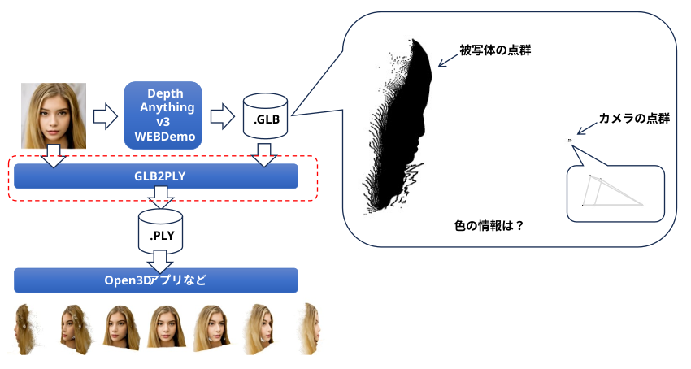
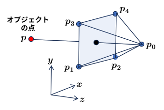

<html lang="ja">
    <head>
        <meta charset="utf-8" />
    </head>
    <body>
        <h1>
Glb2Ply
</h1>
        <h2>なにものか？</h2>
        

          ・Depth Anything v3 の WEBデモなど, RGB画像から奥行き推定や3D化をした結果は glbでしかダウンロードできない。 
          ・glb の点群に RGB情報が見当たらなかったため, 点群に元のRGB画像の色情報を付加してみた。 
          　(多分探せば良いツールがいくらでもありそうだけど･･･) 
          ・glb/glTF の仕様書を確認していない適当な実装。 
             
            
        

        <h2>環境構築方法</h2>
        

            pip install opencv-python open3d trimesh
        

        <h2>使い方</h2>
        

           ● GLBファイルにRGB情報を付加してPLYファイルとして書き出す。 
　　           python glb2ply.py  (RGB画像ファイル)  (glbファイル)  [(zスケール)] 
 
           ● PLYファイルの確認方法        
               python o3d_display_ply.py (plyファイル) 

　　　　　　 <table border="1">
                <tr><th>操作</th><th>機能</th></tr>
                <tr><td>左ボタン押下＋ドラッグ</td><td>3Dモデルの回転</td></tr>
                <tr><td>ホイールボタン押下＋ドラッグ</td><td>3Dモデルの移動</td></tr>
                <tr><td>ホイール回転</td><td>3Dモデルの拡大・縮小</td></tr>
                <tr><td>PrintScreenキー押下</td><td>スクリーンショット保存</td></tr>
                <tr><td>ESCキー押下 または ウィンドウ閉じるボタン押下　</td><td>プログラム終了</td></tr>
            </table>

            ● 点群PLYのメッシュ化 
            　python o3d_pcd_to_mesh.py (plyファイル) 
        

        <h2>備忘録</h2>
        

        ・GLBファイルにはオブジェクトの点群とカメラの点群が格納されていた。 
        ・カメラの点群は, 16個の(x,y,z)座標。 
        ・カメラパラメータかと思ったが, それっぽい値(0や1)が全くなく、カメラの視錐体(ピラミッド)と想定。 
        ・ピラミッドの頂点なら5点で良いがなぜ16個もデータがある？ 
        ・データを見るとユニークな座標は5種類。 
        　→ ピラミッドの辺は8個  
        　→ 始点と終点で16個格納されていると想像。 
          
         ・上図の配置を想定。 
         ・z 座標が一番大きい点を p0 としてオブジェクトの各点と p0 を結ぶ直線と
面 p1p2p4p3 の交点の座標のRGB画像の色を点群に付加した。
        

    </body>
</html>
